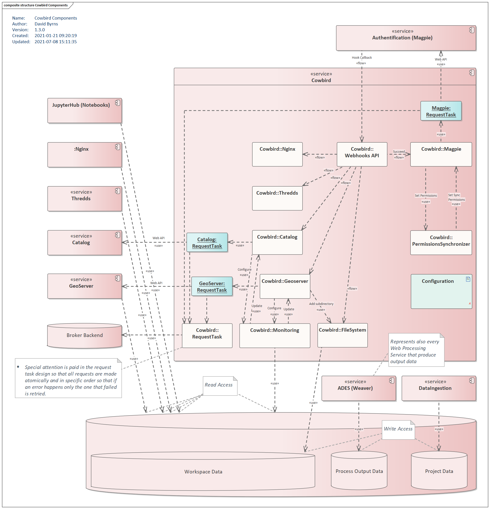

.. include:: references.rst

.. _components_page:

Components
==========

Components Diagram
-------------------

.. _components_handlers:

Handlers
--------

Each handler is associated to a service and is used to process different events and to keep the different services of
the platform synchronized. Handlers are useful for example to process user or permission changes,
or to manage file modification events.

.. _components_filesystem:

FileSystem
~~~~~~~~~~

The `FileSystem` handler is used to manage some aspects of the directory/file structure associated with the platform.
It is specifically used to handle user workspaces and the user access to different other directories.
The handler is responsible for creating/deleting a workspace if a user is created/deleted.

Here are some typical directories found in the ``user_workspaces``:

.. code-block:: bash

    /user_workspaces/<user_name>/notebooks -> /jupyterhub_user_data/<user_name>
    /user_workspaces/<user_name>/shapefile_datastore  # Managed by the `GeoServer` handler
    /user_workspaces/public/wpsoutputs  # Managed by the `FileSystem` handler

.. _filesystem_jupyterhub_user_data:

JupyterHub user data
####################

A symlink is created in the user workspace to give access to the notebook directory of the user. The notebook directory
is the directory that was originally mounted in `bird-house`_ as the ``writable-workspace``. When adding the `Cowbird`
component to `bird-house`_ (see
`here <https://github.com/bird-house/birdhouse-deploy/blob/master/birdhouse/components/README.rst#cowbird>`__), the
mounted ``writable-workspace`` becomes the user workspace managed by `Cowbird` (e.g.: ``/user_workspaces/<user_name>``)
which requires a symlink to access the notebook directory originally used by `bird-house`_ and `JupyterHub`.

.. _filesystem_wps_outputs_data:

WPS outputs data
################

The WPS outputs data, generated by the different WPS birds and `Weaver`_, is stored in a distinct data directory and
must be made accessible to the users via their workspace.

There are 2 types of data :

- Public data: This data must be accessible to every user.
- User specific data: This data must only be accessible to the related user.

The public WPS outputs data is made accessible by generating hardlinks from the WPS outputs data directory to the
user workspaces location (e.g.:``/user_workspaces/public/wpsoutputs``). When a `JupyterLab` instance is started via
`bird-house`_, the directory containing the hardlinks will be mounted as a volume, such that the users obtain access to
its content via their `JupyterLab` instance. The volume will be made read-only to prevent a user from modifying
the public data.

The user WPS outputs data is made accessible by generating hardlinks from a WPS outputs data directory containing user
data to a subdirectory found in the related user's workspace. For example, with a source path
``/wpsoutputs/<bird-name>/users/<user-id>/<job-id>/<output-file>``, a hardlink is generated at the path
``/user_workspaces/<user-name>/wpsoutputs/<bird-name>/<job-id>/<output-file>``. The hardlink path uses a similar
structure as found in the source path, but removes the redundant ``users`` and ``<user-id>`` path segments. The
hardlink files will be automatically available to the user on a `JupyterLab` instance since the workspace is mounted as
a volume. Any file that is found under a directory ``/wpsoutputs/<bird-name>/users/<user-id>/`` is considered to be
user data and any outside file is considered public.

The permissions found on the user data are synchronized with the permissions found on `Magpie`_. If `Magpie`_ uses a
`secure-data-proxy` service, this service handles the permissions of those files (see `here <https://github.com/
bird-house/birdhouse-deploy/blob/master/birdhouse/optional-components/README.rst#control-secured-access-to-wps-
outputs>`__). If a file does not have a corresponding route on the `secure-data-proxy` service, it will use the closest
parent permissions.

.. note::
    If the access to a WPS outputs file is allowed, the file access will be read-only and any write permissions from the
    `secure-data-proxy` service will be ignored. This is because WPS outputs are produced by external processes and
    the resulting data should remain constant.

.. warning::
    The route resources found under the `secure-data-proxy` service must match exactly a path on the filesystem,
    starting with the directory name ``wpsoutputs``, and following with the desired children directories/file names.

If the file does not have any read or write permissions, the hardlink will not be available in the user's workspace.

.. note::
    Permissions should not be modified via the file system, but should only be managed via the
    `secure-data-proxy` service on Magpie. Permission modifications on the file system will be ignored.

    Refer to `DAC-571 <https://crim-ca.atlassian.net/browse/DAC-571>`_ for more details on the design choices for the
    management of permissions.

If no `secure-data-proxy` service is found, the user files are assumed to be fully available
with read and write permissions for the user.

Note that different design choices were made to respect the constraints of the file system and to prevent the user from
accessing forbidden data:

- To avoid having to copy every file from the WPS outputs data directory to the corresponding user workpaces, the usage
  of links was chosen.
- The usage of hardlinks was chosen instead of symlinks. The reason is that using symlinks would require mounting the
  WPS outputs data directory on the user `JupyterLab` instance. This is because symlinks require access to their source
  files, contrary to hardlinks which can be mounted individually without access to source files. Mounting the
  whole WPS outputs data directory would give the user access to all the data. Even if the data is
  not made available on the `JupyterLab` browser via the UI, the data would still be accessible via the terminal found
  on `JupyterLab`. Using hardlinks lets us mount only the public directory instead of the whole WPS outputs directory,
  which contains a mix of public and user data.
- Changing permissions of the linked workspace files to control user access was not an option since symlinks
  and hardlinks always use the same permissions as their original source file. Symlinks/hardlinks cannot have custom
  file permissions independent from their source file.
  Therefore, it is not possible for example to give access to a user and prevent the access to another user for a
  specific file using the file permissions, even if users have their own hardlinks or symlinks in their personal
  workspace.
- Another considered option was to add anonymous volumes to hide some parts of the WPS outputs data directory. This
  could have been useful to mount the whole WPS outputs directory on the user `JupyterLab` instance and to
  hide the user data subdirectories found in the WPS outputs by using anonymous volumes for each user subdirectory. This
  would automatically mount the public data while hiding the user related data. It was still considered easier and safer
  to go with the hardlinks option to prevent potential errors which could accidentally give access to other users' data.
  For example, if a bird directory was created while a user `JupyterLab` instance was running, it would require both the
  instance and `JupyterHub` to be restarted in order to generate the new required anonymous volume to hide the user data
  from that new bird. Without a restart of the instance, the user could potentially have access to some of the new user
  data found in the new bird directory.

In conclusion, the best option was to use hardlinks, which do not require access to the original source file, to create
separate user and public data access points, and volume mounting to control which locations are made available to the
user.

.. seealso::
    Refer to `DAC-149 <https://crim-ca.atlassian.net/browse/DAC-149>`_ for details on the design choices for managing
    the access to WPS outputs data.

.. _components_geoserver:

Geoserver
~~~~~~~~~

The `GeoServer`_ handler is used to keep the internal representation on the `GeoServer`_ server along with the user
workspace in sync with the rest of the platform.

If a new user is created on `Magpie`_, a `GeoServer`_ workspace is automatically created for the user, along with a
datastore directory in the user workspace to contain the different shapefiles of the user. Similarly, if the user is
deleted on `Magpie`_, the `GeoServer`_ workspace of the user is automatically deleted to keep the services
synchronized.

The workspace and file permissions are also synchronized between `Magpie`_ and `GeoServer`_. For example, if a
permission is added or removed in `Magpie`_, the file found in the user's datastore must have corresponding permissions
in order to reflect the actual user access permissions.

Since the `Magpie`_ permissions on a resource from a service of type `GeoServer`_ are not the same as traditional Unix
permissions (e.g.: ``rwx``) on the workspace/shapefiles, some design choices were done in order to have a coherent
synchronization :

.. _geoserver_permission_category_definition:

Permission/Category definition
##############################

All permissions on `Magpie`_ on a resource from a service of type `GeoServer`_ are classified as either readable or
writable in order to associate them to the actual path permissions.
If the path receives a ``read`` permission, all `Magpie`_ permissions fitting the readable category will be enabled.

If a `Magpie`_ permission from the readable category is added, the path will be updated to have ``read`` permissions.
This update on the file system will trigger a synchronization with `Magpie`_, to add all other readable permissions on
`Magpie`_. For example, if the ``GetFeature`` permission is added to a ``Layer`` resource on `Magpie`_, the associated
shapefile will receive ``read`` permissions because ``GetFeature`` is a permission from the readable category. Since the
file permissions are modified, it will trigger another event to synchronize permissions with `Magpie`_, enabling,
on the ``Layer`` resource, all other readable permissions : ``DescribeFeatureType``, ``DescribeStoredQueries``,
``GetCapabilities``, etc. The same process would apply if we use permissions from the writable category in this last
example.

.. _geoserver_permission_creation_conditions:

Permission creation conditions
##############################

Note that permissions are only added to `Magpie`_ if necessary. For example, if a file needs to allow a readable
permission on `Magpie`_, but that permission already resolves to ``allow`` because of a recursive permission on a parent
resource, no permission will be added. The permission is already resolving to the required permission and avoiding to
add unnecessary permissions will simplify permission solving.

Also, in the case where a user has all the readable permissions enabled on `Magpie`_, for example, and a single one
of them is deleted, `Cowbird` will not change the file permissions since other permissions from the readable category
will still be found on `Magpie`_. This means that a synchronization will not be triggered and `Magpie`_ permissions will
stay the same, meaning all the readable permissions activated except for the one removed.
If eventually a change is applied to the file (e.g.: changing the permissions from ``r--`` to ``rw-``),
it would trigger a synchronization, and the one `Magpie`_ permission that was removed earlier would be re-enabled,
because of the ``read`` permission found on the file.
Consequently, it is not recommended to have a partial usage of readable permissions on `Magpie`_ since there is a risk
that the disabled readable permissions will be eventually automatically enabled if an update on the file is done. If we
want to disable the read permissions via `Magpie`_, it is better to disable the permissions from the readable category
all at once, which will trigger a change to remove the ``read`` permission on the associated path and which will prevent
having eventual undesired re-enabled `Magpie`_ permissions.
The same would apply if we use ``write`` permissions in this last example.

The permissions applied on the files/directories are only applied to ``others``, and the permissions on the ``user``
and on the ``group`` are not modified by the `GeoServer`_ handler. The user and group associated with the files will be
the admin user/group (``root`` by default), while the user who will interact with the files, for example in
`JupyterHub`, is a distinct user, hence why the permissions are applied to ``others``. This will also prevent the user
from changing the permissions if he decides to interact with the terminal accessible via `JupyterLab`.
Note that, consequently, the concept of a `Magpie`_ group is not used on the file system for now. This means that if a
permission is applied to a group in `Magpie`_, `Cowbird` will detect the permission change but will not do anything,
since the group on the file system does not correspond to the groups found on `Magpie`_. Also, it would not make sense
to update the file associated to a resource for all the users of a group, since the file is supposed to be associated
to a single user anyway.

Note that even if group permission changes on `Magpie`_ are not handled by `Cowbird`, a group permission could still
have an impact on permission resolution. For example, if a shapefile needs to allow a readable permission on `Magpie`_,
but that permission already resolves to ``allow`` because of a group permission, no permission will be added.

.. _geoserver_file_layer_permissions:

File/Layer permissions
######################

File events will only be processed in the case of the ``.shp`` file, since it is considered to be the main
component of a shapefile. The other extensions associated with a shapefile will not be processed if they trigger an
event, and will only be updated in the case of a change on the ``.shp`` file.

Shapefiles will only be assigned ``read`` or ``write`` permissions on the file system. ``execute`` permissions are not
needed for shapefiles.

.. _geoserver_directory_workspace_permissions:

Directory/Workspace permissions
###############################

Workspaces will always keep their ``execute`` permissions even if they don't have any permissions enabled on `Magpie`_.
This enables accessing the children files, in case the children resource has permissions enabled on `Magpie`_.
Since a children resource has priority on `Magpie`_ if its permissions are enabled, it makes sense to allow the access
to the file on the file system too. Note that if the directory only has ``execute`` permissions, the file will only be
accessible via a direct path or url, and it will not be accessible via a file browser, or on the JupyterLab file
browser. This should allow the user to still share his file using a path or url. To allow browsing the directory's
content, the ``read`` permission is also required on the directory, which can be obtained by enabling permissions of the
readable category on the corresponding workspace on `Magpie`_.

.. _geoserver_operations_to_avoid:

Operations to avoid
###################

Note that some operations should be avoided, as they are undesirable and not supported for now.

- Using subdirectories in the shapefile datastore :
    Using subdirectories in the shapefile datastore directory is not supported for now. Only the shapefiles found
    directly under the datastore directory will be processed by the `GeoServer`_ handler and subdirectories will be
    ignored. This also corresponds to the design in `Magpie`_ where a ``Workspace`` resource can only have children
    resources of the type ``Layer``, and cannot have a ``Workspace`` type resource as a children.

- Renaming a directory :
    The directories associated with the `GeoServer`_ workspace are the user workspace (named by the user's name)
    and the datastore directory (which uses a default value). Both of these values should never change and renaming them
    manually might break the monitoring, preventing `Cowbird` from receiving future file events.

- Renaming a shapefile (.shp only) :
    This operation is actually supported, but it should be avoided if possible. It will trigger multiple events on the
    file system (an update on the parent directory, and a delete followed by a create event on the file), which should
    keep up to data info in `GeoServer`_ and `Magpie`_ by simply generating new resources. A risk with this is that the
    delete event will delete the other shapefile files, and the user could lose some data. It is better to have a copy
    of the shapefile before applying this operation. Note that renaming one of the other extension (not the .shp file)
    will not trigger any event since only the main file triggers events.

- Deleting a directory :
    This operation will only display a warning in `Cowbird`'s logs. It should never be done manually, since it will
    create inconsistencies with the `GeoServer`_ workspace and the `Magpie`_ resources. The user workspace and the
    datastore directory should only be deleted when a user is deleted via `Magpie`_.
